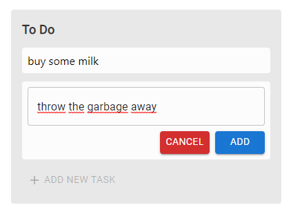

<h1 align="center">
  <a href="https://github.com/hasanhg/todo-go">
    <!-- Please provide path to your logo here -->
    
  </a>
</h1>

  To Do Go
   
  <a href="#about"><strong>Explore the screenshots »</strong></a>
   
   
  <a href="https://github.com/hasanhg/todo-go/issues/new?assignees=&labels=bug&template=01_BUG_REPORT.md&title=bug%3A+">Report a Bug</a>
  ·
  <a href="https://github.com/hasanhg/todo-go/issues/new?assignees=&labels=enhancement&template=02_FEATURE_REQUEST.md&title=feat%3A+">Request a Feature</a>
  .
  <a href="https://github.com/hasanhg/todo-go/issues/new?assignees=&labels=question&template=04_SUPPORT_QUESTION.md&title=support%3A+">Ask a Question</a>

 

Table of Contents

- [About](#about)
  - [Built With](#built-with)
- [Getting Started](#getting-started)
  - [Prerequisites](#prerequisites)
  - [Installation](#installation)
- [Roadmap](#roadmap)
- [Support](#support)
- [Project assistance](#project-assistance)
- [Contributing](#contributing)
- [Authors & contributors](#authors--contributors)
- [Security](#security)
- [License](#license)

---

## About

> To Do Go is a web application where the user can add tasks to the list and
> get all the tasks created previously. 

Screenshots

 

|                               To Do List                               |                               Adding a Task                               |
| :-------------------------------------------------------------------: | :--------------------------------------------------------------------: |
|  |  |

### Built With

> <a href="https://github.com/golang/go">Go</a>

> <a href="https://github.com/facebook/react">React</a>

> <a href="https://github.com/redis/redis">Redis</a>

> <a href="https://github.com/kubernetes/kubernetes">Kubernetes</a>

> <a href="https://github.com/pact-foundation/pact-go">Pact Go</a>

> <a href="https://github.com/actions">GitHub Actions</a>

## Getting Started

### Prerequisites

To Do Go requires 
* a database to keep track of tasks pushed to the list, only Redis is supported currently,

* a Kubernetes cluster to deploy both <a href="https://github.com/hasanhg/todo-go/tree/master/todo-api">todo-api</a> and <a href="https://github.com/hasanhg/todo-go/tree/master/todo-client">todo-client</a>,

* a GitHub account to run the workflow created for building/testing and deploying the project on every commit in an automated way.

### Installation

You can install your own production environment by applying the YAML files to your Kubernetes cluster at <a href="https://github.com/hasanhg/todo-go/tree/master/todo-api/k8s">todo-api/k8s</a> and <a href="https://github.com/hasanhg/todo-go/tree/master/todo-client/k8s">todo-client/k8s</a> folders.

> **[!]** Do not forget to deploy nginx ingress controller on your cluster and to make necessary changes in deployment and ingress YAML files.

## Roadmap

See the [open issues](https://github.com/hasanhg/todo-go/issues) for a list of proposed features (and known issues).

- [Top Feature Requests](https://github.com/hasanhg/todo-go/issues?q=label%3Aenhancement+is%3Aopen+sort%3Areactions-%2B1-desc) (Add your votes using the 👍 reaction)
- [Top Bugs](https://github.com/hasanhg/todo-go/issues?q=is%3Aissue+is%3Aopen+label%3Abug+sort%3Areactions-%2B1-desc) (Add your votes using the 👍 reaction)
- [Newest Bugs](https://github.com/hasanhg/todo-go/issues?q=is%3Aopen+is%3Aissue+label%3Abug)

## Support

Reach out to the maintainer at one of the following places:

- [GitHub issues](https://github.com/hasanhg/todo-go/issues/new?assignees=&labels=question&template=04_SUPPORT_QUESTION.md&title=support%3A+)
- The email which is located [in GitHub profile](https://github.com/hasanhg)

## Project assistance

If you want to say **thank you** or/and support active development of To Do Go:

- Add a [GitHub Star](https://github.com/hasanhg/todo-go) to the project.
- Tweet about the To Do Go on your Twitter.
- Write interesting articles about the project on [Dev.to](https://dev.to/), [Medium](https://medium.com/) or personal blog.

Together, we can make To Do Go **better**!

## Contributing

First off, thanks for taking the time to contribute! Contributions are what make the open-source community such an amazing place to learn, inspire, and create. Any contributions you make will benefit everybody else and are **greatly appreciated**.

We have set up a separate document containing our [contribution guidelines](docs/CONTRIBUTING.md).

Thank you for being involved!

## Authors & contributors

The original setup of this repository is by [Hasan Gürsoy](https://github.com/hasanhg).

For a full list of all authors and contributors, check [the contributor's page](https://github.com/hasanhg/todo-go/contributors).

## Security

To Do Go is provided **"as is"** without any **warranty**. Use at your own risk.

_For more info, please refer to the [security](docs/SECURITY.md)._

## License

This project is licensed under the **Apache License 2.0**.

See [LICENSE](LICENSE) for more information.

